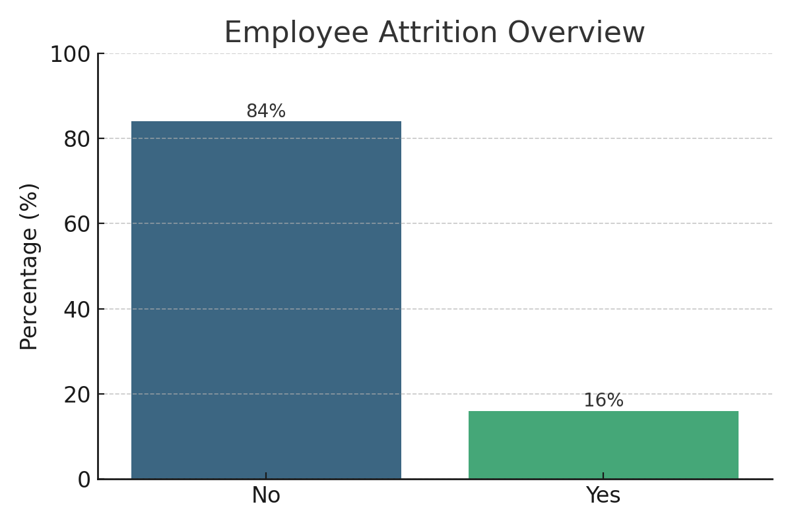
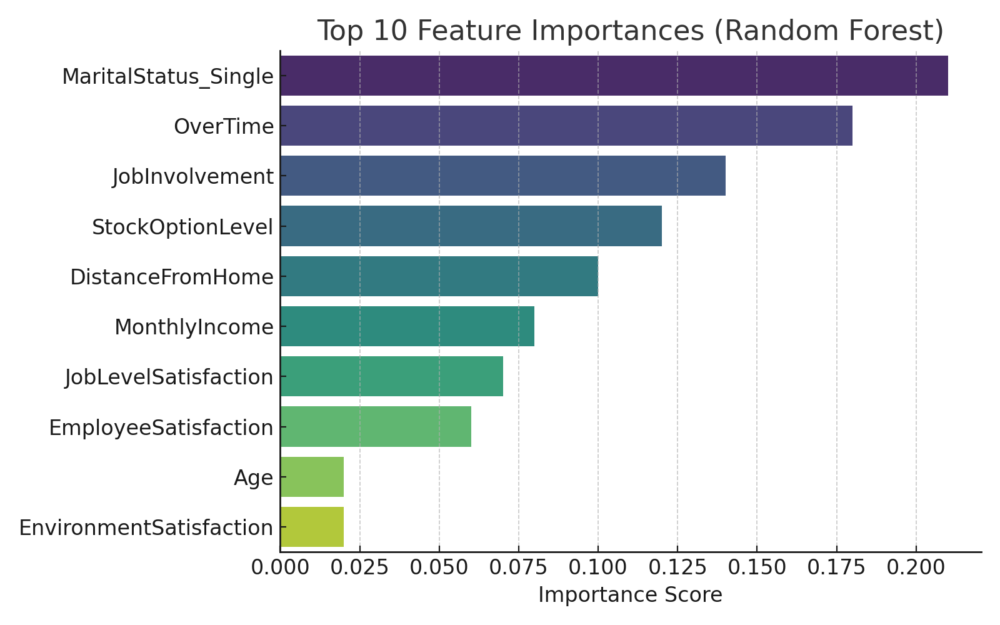

# 🧠 Employee Attrition Prediction  
Final Project - Rakamin Data Science Bootcamp (Team DataMinds)

---

## 1. 📌 Background & Objective

**Background:**  
Employee attrition is a critical issue for organizations, directly affecting productivity, workforce stability, and recruitment costs. Based on the IBM HR Analytics dataset, the attrition rate stands at 16%, significantly above the ideal rate of 4–6%.

**Why This Analysis Matters:**  
Understanding the underlying factors of employee attrition allows companies to make data-driven decisions aimed at retaining top talent. Predictive modeling enables proactive HR interventions and cost-saving strategies.

**What Will Change With the Analysis Results:**  
- Companies can target high-risk employee groups (e.g., single employees, frequent overtime workers).
- Implement data-backed engagement programs and work-life balance policies.
- Save up to 87% in turnover-related costs with precise, model-informed actions.

---

## 2. 🔍 Problem Statement & Scope

**Problem to Solve:**  
To predict which employees are at risk of leaving the company using historical HR data and machine learning models.

**Expected Model Output:**  
- Binary classification: `Attrition = Yes/No`  
- Probability score of attrition risk  
- Feature importance analysis to identify key influencing factors

---

## 3. 📊 Dataset & Assumptions

**Dataset:**  
[IBM HR Analytics Employee Attrition & Performance](https://www.ibm.com/analytics/hr-employee-attrition)

**Key Features:**
- Demographics: `Age`, `Gender`, `MaritalStatus`
- Job Details: `JobRole`, `Department`, `JobLevel`
- Satisfaction Metrics: `JobSatisfaction`, `EnvironmentSatisfaction`, `RelationshipSatisfaction`
- Performance: `PerformanceRating`, `OverTime`
- Compensation: `MonthlyIncome`, `StockOptionLevel`, `PercentSalaryHike`

**Target Variable:**
- `Attrition` (`Yes` = left, `No` = stayed)

**Assumptions:**
- No missing values
- Outliers handled using Z-score
- Class imbalance addressed via SMOTE
- Engineered features added: `EmployeeSatisfaction`, `JobLevelSatisfaction`

---

## 4. 📈 Data Analysis & Modeling

### 🔍 EDA Insights:
- Majority of employees are aged 30–40 and live <10 km from work.
- Higher attrition observed among single employees and those with frequent overtime.
- High job involvement and satisfaction are linked to retention.

### 📌 Feature Selection:
- Positively correlated: `MaritalStatus_Single`, `OverTime`
- Negatively correlated: `JobInvolvement`, `StockOptionLevel`, `JobSatisfaction`

### ⚙️ Machine Learning Models Tried:
- Logistic Regression  
- Decision Tree  
- Random Forest  
- Support Vector Machine  
- K-Nearest Neighbors  

### ✅ Best Model:
- **Random Forest**
- **F1 Score:** 0.93
- **AUC:** 0.9743

---

## 5. 🧾 Conclusion

**Selected Model:** Random Forest (high accuracy and F1 Score)

**Top Features Influencing Attrition:**
- `MaritalStatus_Single`
- `OverTime`
- `JobInvolvement`
- `StockOptionLevel`
- `DistanceFromHome`

**Key Insights:**
- Single employees and those with overtime are at higher risk.
- Job satisfaction and involvement significantly affect retention.
- Strategic focus on high-risk groups is advised.

---

## 6. 💡 Recommendations & Next Steps

**Recommended Actions:**
- Implement engagement initiatives for single employees.
- Re-evaluate and manage overtime policies.
- Regularly survey job satisfaction and work-life balance.
- Provide stock options and growth incentives.

**Future Enhancements:**
- Integrate real-world company data for better model accuracy.
- Develop an interactive HR dashboard with Streamlit.
- Test model on different industry datasets for broader applicability.

---

## 📚 Resources
- [LinkedIn – Vita Dewi Wulandari](https://www.linkedin.com/in/vita-dewi-wulandari-5a2b4a141/)
- [GitHub – VitaDewiw](https://github.com/Vitadewiw)
- [Streamlit App – Employee Attrition Dashboard](https://rakamin-finpro.streamlit.app/)

---

## 🚀 Streamlit Dashboard Preview

🔗 **Live App:** [https://rakamin-finpro.streamlit.app/](https://rakamin-finpro.streamlit.app/)

This interactive dashboard allows users to:
- Explore attrition by demographic and job categories
- Visualize feature importance and prediction probabilities
- Simulate scenarios based on selected employee traits

  

---
